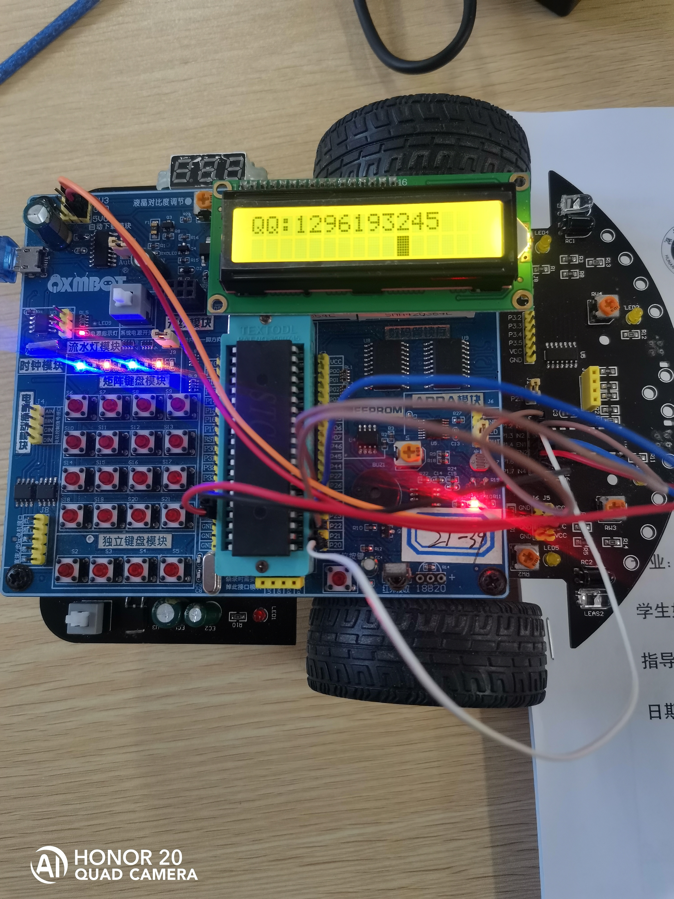
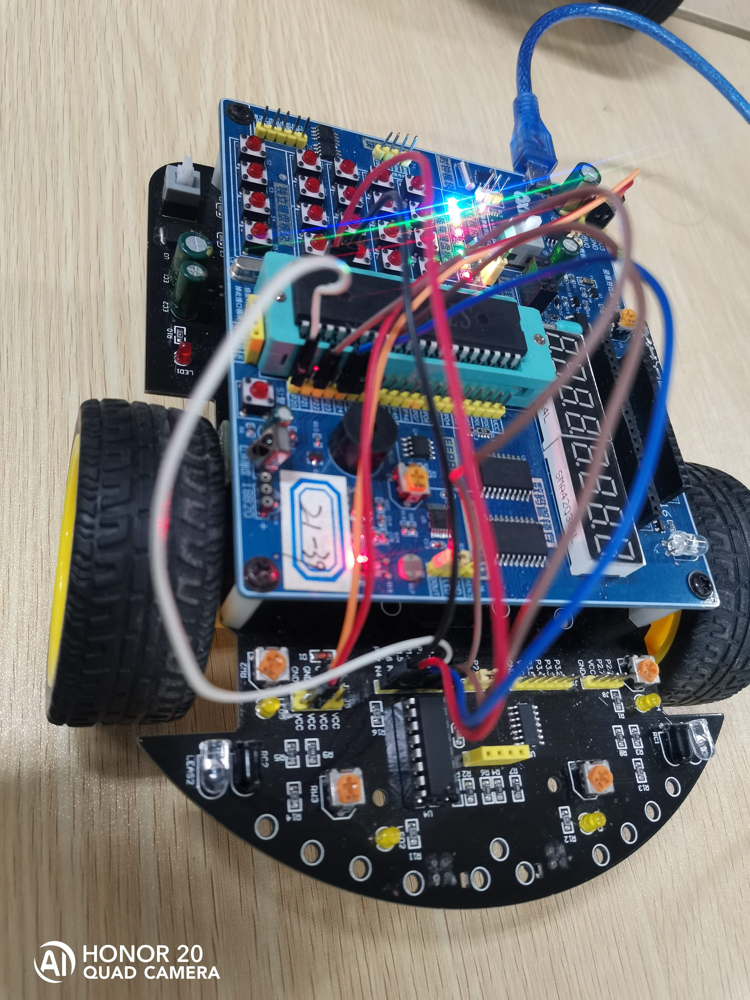
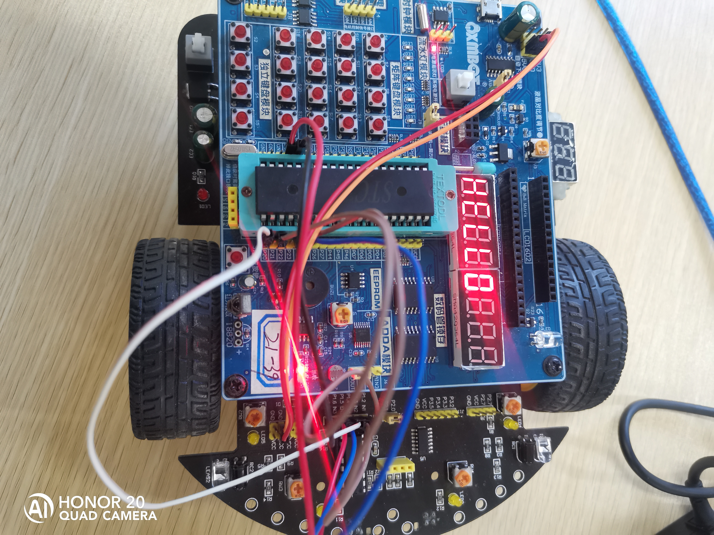

# stc89c51/stc89c52单片机代码

包含以下内容

* 操作led灯
* 流水灯
* 操作数码管
* 操作蜂鸣器
* 操作独立按键
* 操作4x4矩阵按键
* 操作小车前后左右
* 中断技术--外部中断和计时器中断
* 串口中断


<br>

<br>


利用串口中断技术实现以下功能：

1. 打开蜂鸣器
2. 关闭蜂鸣器
3. 打开4个灯
4. 关闭所有灯
5. 小车前进
6. 小车后退
7. 小车左转
8. 小车右转
9. 小车停止
10. 数码管显示hello
11. 数码管显示生日
12. 数码管显示第二个生日
13. 数码管显示学号
14. 流水灯
15. 流水灯2
16. 13LCD1602显示hello
17. 13LCD1602显示123456
18. 13LCD1602显示0234
19. 13LCD1602显示china
20. 13LCD1602显示我的github账号
21. 13LCD1602显示我的QQ
22. 13LCD1602轮询显示数字0到9
23. 蜂鸣器播放音乐"祝你平安"
24. 蜂鸣器播放音乐"我和我的祖国"


<br>

<br>


关键代码：

```c

void UART() interrupt 4
{
	unsigned char temp = 0;


	if (RI)
	{
		RI = 0;
		//接收数据
		temp = SBUF;
		//清空接受数据标志位

		//接受数值	 
		if (temp == 1)
		{
			BEEP = 0;
		}
		//接受字符
		else if (temp == 2)
		{
			closebeep();
		}

		else if (temp == 3)
		{
			Openled4();
		}
		else if (temp == 4)
		{
			P1 = 0xff;
		}
		else if (temp == 5)
		{
			car_forward();
		}
		else if (temp == 6)
		{
			car_return();
		}
		else if (temp == 7)
		{
			car_left();
		}
		else if (temp == 8)
		{
			car_right();
		}
		else if (temp == 9)
		{
			car_stop();
		}

		else if (temp >= 10 && temp <= 15)
		{
			UARTStatus = temp;
		}

		else if (temp == 16)
		{
			uchar* str = "HELLO";
			led_1602_show(str);
		}

		else if (temp == 17)
		{
			uchar* str = "123456";
			led_1602_show(str);
		}

		else if (temp == 18)
		{
			uchar* str = "0234";
			led_1602_show(str);
		}

		else if (temp == 19)
		{
			uchar* str = "china";
			led_1602_show(str);
		}

		else if (temp == 20)
		{

			uchar* str = "github:maomao124";
			led_1602_show(str);
		}

		else if (temp == 21)
		{
			uchar* str = "QQ:1296193245";
			led_1602_show(str);
		}

		else if (temp == 22)
		{
			UARTStatus = temp;
		}

		else if (temp == 25)
		{
			UARTStatus = 0;
		}


		UARTStatus = temp;

		//数据传送回去
		temp++;
		SBUF = temp;

	}
	if (TI)
		TI = 0;

}
```


```c
void init_UART_main_lock()
{
	while (1)
	{

		if (getUARTStatus() == 10)
		{
			led_stop();
			showHello();
		}
		if (getUARTStatus() == 11)
		{
			led_stop();
			showBirthday();
		}
		if (getUARTStatus() == 12)
		{
			led_stop();
			showBirthday1();
		}
		if (getUARTStatus() == 13)
		{
			led_stop();
			showStudentId();
		}

		if (getUARTStatus() == 14)
		{
			led_stop();
			FLOW_LED2();
		}
		if (getUARTStatus() == 15)
		{
			led_stop();
			FLOW_LED3();
		}
		if (getUARTStatus() == 22)
		{
			uchar* str = "1";
			led_1602_show(str);
			delay_ms(500);
			str = "2";
			led_1602_show(str);
			delay_ms(500);
			str = "3";
			led_1602_show(str);
			delay_ms(500);
			str = "4";
			led_1602_show(str);
			delay_ms(500);
			str = "5";
			led_1602_show(str);
			delay_ms(500);
			str = "6";
			led_1602_show(str);
			delay_ms(500);
			str = "7";
			led_1602_show(str);
			delay_ms(500);
			str = "8";
			led_1602_show(str);
			delay_ms(500);
			str = "9";
			led_1602_show(str);
			delay_ms(500);
			str = "0";
			led_1602_show(str);
			delay_ms(500);
		}

		else if (getUARTStatus() == 0)
		{
			P1 = 0xff;
			P2_3 = 1;
			led_stop();
		}
		else if (getUARTStatus() == 23)
		{
			Time0_Init();
			music1();
		}

		else if (getUARTStatus() == 24)
		{
			music2_init();			//定时器0中断初始化
			music2();	         	//播放
		}


		delay_ms(5);
	}
}
```


<br>

<br>


### 图片


时间：2022/12/01











